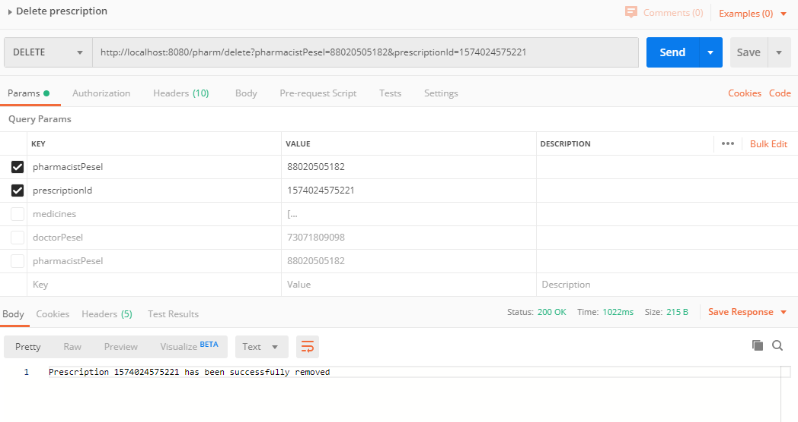

# PHARMACY
REST application for prescription management.
- 3 types of users: pharmacist, doctor, patient, with different priviledges
- possibility to view/add/delete prescriptions
- object serialization after every add/delete operation

#TECH STACK
- Java 8
- Postman (as a REST client)
- Maven
- IDE: Intellij Idea

All prescriptions for a given patient pesel can be viewed:

Prescriptions can be added:

...and a new id is automatically generated.

Deleting prescription:

